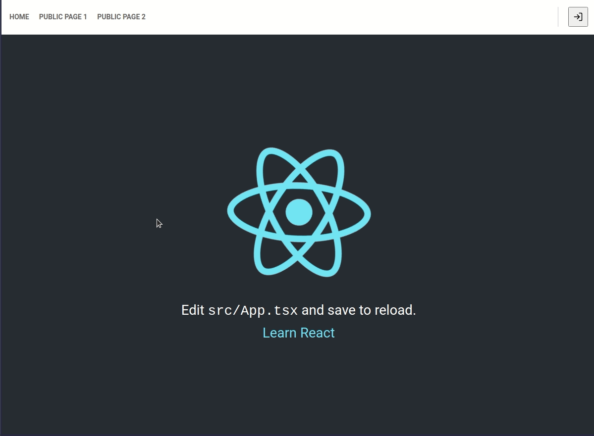
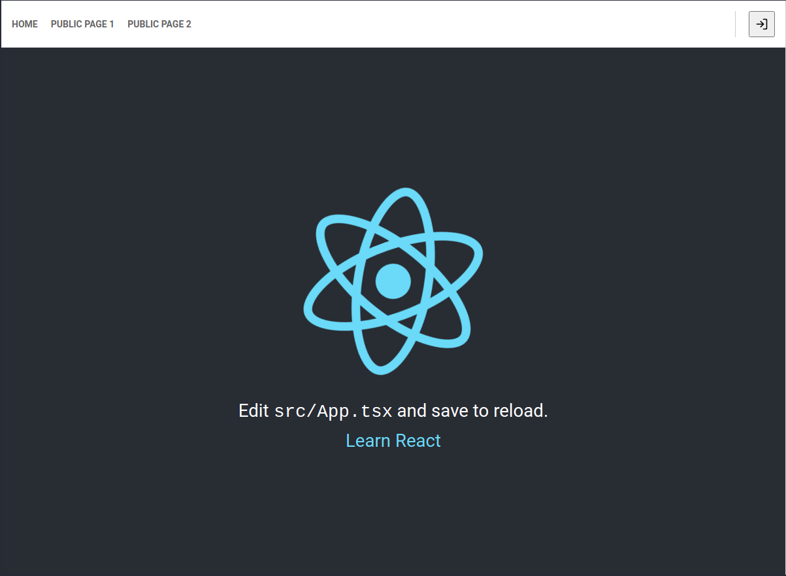
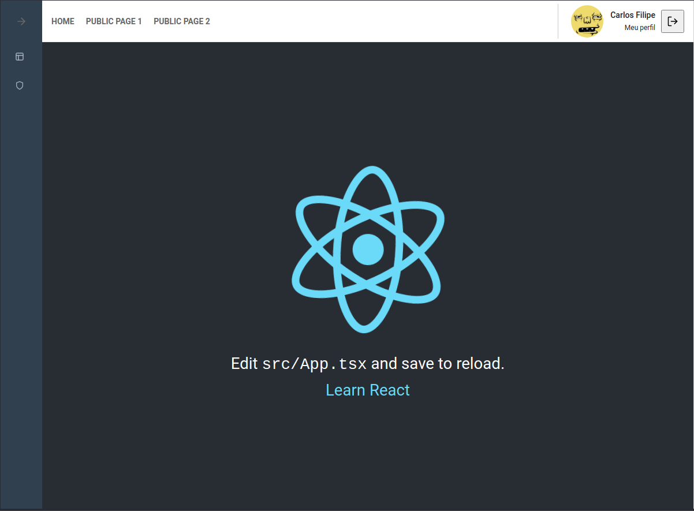
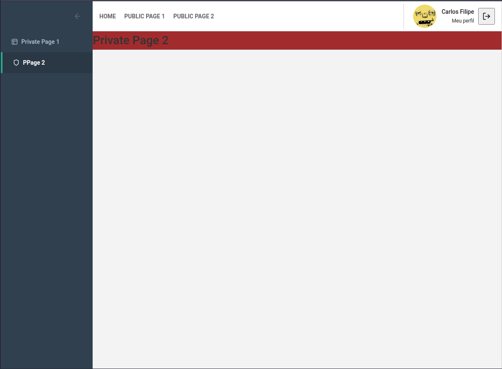
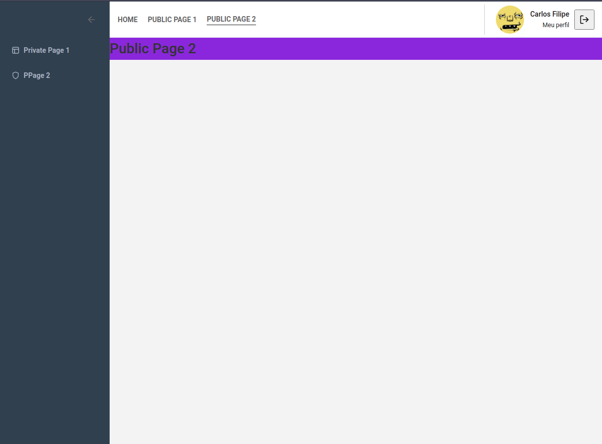

This project was bootstrapped with [Create React App](https://github.com/facebook/create-react-app).

  

## Side menu for private routes example for ReactJS with typescript

In the project directory, you can run:

### `yarn`

To install all dependencies

### `yarn start`

Runs the app in the development mode. 
Open [http://localhost:3000](http://localhost:3000) to view it in the browser.

The page will reload if you make edits. 
You will also see any lint errors in the console.

## Images

  
  
  
  

## Dependencies

- [typescript (Apache License 2.0)](https://github.com/microsoft/TypeScript);
- [react (MIT)](https://github.com/facebook/react);
- [react-dom (MIT)](https://github.com/facebook/react/tree/master/packages/react-dom);
- [react-icons (MIT)](https://github.com/react-icons/react-icons) MaterialIcons (Apache License 2.0);
- [react-router-dom (MIT)](https://github.com/ReactTraining/react-router/tree/master/packages/react-router-dom);
- [react-scripts (MIT)](https://github.com/facebook/create-react-app/tree/master/packages/react-scripts);
- [styled-components (MIT); ](https://github.com/styled-components/styled-components)

## License

MIT © mourabraz@hotmail.com
